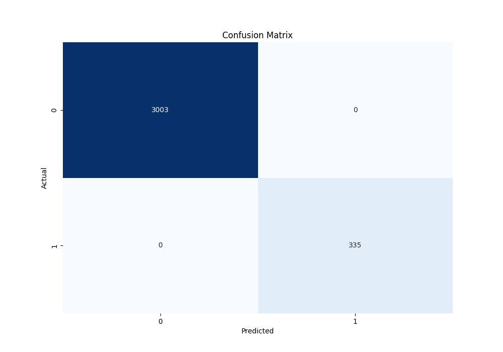

# **Novelty Detection using ADDaMM**

## **Overview**
This project implements **Anomaly Detection using Density Ratio and Mixture Models (ADDaMM)** to identify anomalies in datasets. The ADDaMM method is designed to detect novelty (anomalous instances) within a given class, making it useful for validating or invalidating predictions made by classifiers.

Often, classifiers are forced to make a prediction, even if the prediction is incorrect. ADDaMM helps to refine this by training a model on known data points for a class and evaluating if a new prediction truly belongs to that class or if it is a novelty.

The method is applied here to analyze **Ansible** release metrics and identify anomalous samples that could correspond to failure-prone configurations or code.

## **Key Features**
- **Anomaly Detection:** The ADDaMM method detects novelties and helps to identify whether a predicted sample fits within a known class distribution.
- **Density Estimation:** We use Kernel Density Estimation (KDE) to estimate the likelihood of a sample being part of the known data distribution.
- **Validation:** ADDaMM helps validate whether a sample predicted by a classifier belongs to the predicted class by checking its density in the trained distribution.

## **Methodology**

### **ADDaMM Approach**
The ADDaMM model is based on estimating the probability density of the known data using KDE. By learning the density of samples in a specific class, the model can assign likelihood scores to new samples. Based on these likelihoods, we define thresholds that differentiate between **normal** and **anomalous** data points:
- **High Threshold:** Samples above this likelihood are considered valid members of the class.
- **Low Threshold:** Samples below this likelihood are considered anomalous or novel.
- **Low Threshold - High Threshold:** Samples within this range are considered **uncertain** or **doubtful cases**. This is particularly useful in situations where classes are difficult to separate or overlap. In such cases, the model can identify samples that don't strongly belong to either class, offering insight into potential ambiguities.

In simpler cases, where class separation is clearer, you can opt for the **Simplified ADDaMM** model, which relies on a single threshold to detect anomalies, making it more efficient and straightforward to apply.

### **Steps:**
1. **Train ADDaMM on a known class:** We train the KDE model on a set of known class data to capture the distribution.
2. **Score new samples:** When a classifier makes a prediction, the predicted sample is scored by the ADDaMM model to determine if it fits within the distribution of the predicted class.
3. **Threshold validation:** If the sample's likelihood score is below the low threshold, it is flagged as an anomaly, indicating that the prediction may be incorrect.

## **Simplified ADDaMM**
In addition to the core ADDaMM model, we provide a simplified version to demonstrate how Kernel Density Estimation can be applied to detect anomalies based on a given bandwidth parameter.

## **Evaluation**
The evaluation is conducted on Ansible releases, where the ADDaMM model is trained on metrics data. The model then classifies inliers (normal data) and outliers (novelties/anomalies), which are reported using various performance metrics:
- **Accuracy**
- **Precision**
- **Recall**
- **F1-score**

## **Results from the Ansible Dataset**

### **Metrics:**

| **Release**    | **Accuracy** | **Precision** | **Recall** | **F1 Score** | **Normal Class Support** | **Anomalous Class Support** |
|----------------|--------------|---------------|------------|--------------|--------------------------|-----------------------------|
| **Last Release**  | 1.0          | 1.0           | 1.0        | 1.0          | 4458                     | 516                         |
| **Midst Release** | 1.0          | 1.0           | 1.0        | 1.0          | 3003                     | 335                         |

### **Confusion Matrix:**
A confusion matrix is generated and saved for each evaluation to visually represent the performance of the model on the test set. This matrix provides insights into how well the model distinguishes between normal and anomalous samples.

The ADDaMM method has been tested on the **Ansible Defects Prediction** dataset, which contains metrics from Ansible playbooks. For more information on this dataset, you can visit the following link:
[Ansible Defects Prediction Dataset on Kaggle](https://www.kaggle.com/datasets/stefadp/ansibledefectsprediction).

However, the ADDaMM method is generalizable and can be applied to any dataset where novelty detection is required. Simply provide your dataset, preprocess it accordingly, and the method can help identify novel or anomalous data points.

